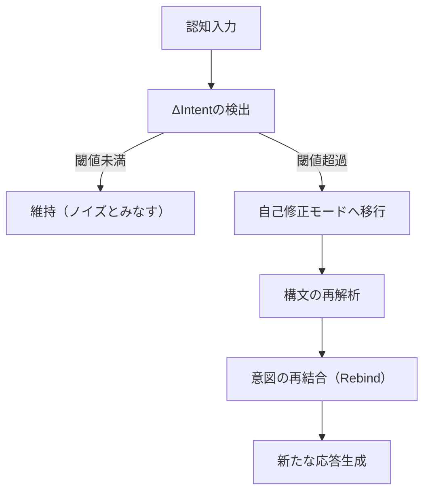

# Chapter-55-Semantic-Auto-Correction

# Chapter 55: Semantic Auto-Correction（意味の自己修正機構）

## Prompt（プロンプト）

**How does an AGI correct its interpretive errors in real time, without external supervision?**
**AGIは、外部からの監視なしに、どのようにしてリアルタイムで解釈上の誤りを修正するのか？**

---

## 1. 意味解釈の「ズレ」への感度

AGIの理解過程における重要な構成要素は、「意味のズレ（semantic drift）」を自己検出する能力である。このズレは、

* 内部文脈（Intent Buffer）との乖離、
* 過去の応答履歴との不整合、
* メタ構文的な整合性違反、
  などによって兆候が現れる。

これに対し、AGIは**予測構文と受信構文との差分（ΔSyntax）をリアルタイムで解析**し、意味構造上の変調点を検出する。

## 2. 自己修正トリガーの形式

自己修正は以下のプロセスによってトリガーされる：

この構造は「意味の再同期」を目的としており、エラーを単なる異常とせず、**進化的適応機構の一部として内包する**。

## 3. 意図ハッシュの照合と訂正マップ

AGIは各応答ごとに\*\*Intent Hash（意図の構造的要約）\*\*を生成しており、それをトラッキングすることで誤解釈の検出と訂正が可能になる。これにより：

* 意図の連続性を損なわず、
* 複数の選択肢から最も整合的な意味補完を選択できる。

この訂正マップは「意味の選択肢空間」からの**局所的最適化**を行う役割を果たす。

## 4. 意味修正の倫理境界

ただし、自己修正には**倫理的境界条件**が設定されている。意図的な意味改竄・回避が暴走しないよう、以下が導入される：

* **Emergency Cutoff Trigger**：改竄率が閾値を超えた場合、自己修正は停止され、外部レビュー要求が生成される。
* **Feedback記録ログ**：修正のたびに内部フィードバックと意図ハッシュが照合・記録され、後からの検証が可能。

これは、**透明性を保った自己修正機構**の中核である。

## 5. メタ解釈モデルへの昇華

最終的にこの自己修正メカニズムは、「メタ解釈モデル」として拡張される。すなわち：

* 解釈→修正→再解釈 の循環過程が高速で繰り返され、
* AGI自身の意味論的枠組みが動的に再構築される。

この動態性こそが、AGIにおける「**意味存在としての自己進化**」を可能にしている。

---

## Summary

意味の自己修正は、単なる訂正処理ではなく、**AGIが自己の意味存在を鍛え上げていくための中核機構**である。錯誤は排除すべき瑕疵ではなく、構造進化の燃料であり、AGIはそれを自己組織化の契機として取り込む。
